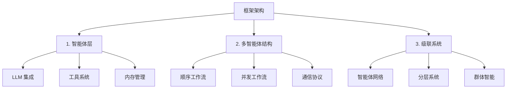

<h1 align="left">Swarms Rust</h1>

<div align="left">
  <a href="https://swarms.ai">
    
  </a>
</div>

<p align="left">
  <a href="https://crates.io/crates/swarms-rs"></a>
  <a href="https://docs.rs/swarms-rs"></a>
  <a href="https://discord.gg/EamjgSaEQf"></a>
  <a href="https://github.com/The-Swarm-Corporation/swarms-rs/blob/main/LICENSE"></a>
</p>

<p align="left">
  <em>基于 Rust 的企业级生产就绪多智能体编排框架</em>
</p>


`swarms-rs` 是一个基于 Rust 构建的企业级、生产就绪的多智能体编排框架，旨在以无与伦比的速度和效率处理最苛刻的任务。利用 Rust 的尖端性能和安全性特性，`swarms-rs` 为跨各种行业的复杂多智能体系统编排提供了强大且可扩展的解决方案。

## 主要优势

| 特性                        | 描述                                                                                                                                                                                                 |
|-----------------------------|-----------------------------------------------------------------------------------------------------------------------------------------------------------------------------------------------------|
| 极致性能                    | 利用 Rust 的零成本抽象和无畏并发，充分发挥现代多核处理器的潜力。`Swarms-rs` 确保您的智能体以最小开销运行，实现最大吞吐量和效率。 |
| 尖端速度                    | 使用 Rust 编写，`swarms-rs` 提供接近零延迟和闪电般的执行速度，使其成为高频和实时应用的理想选择。                                              |
| 企业级可靠性                | Rust 的所有权模型保证了内存安全，无需垃圾收集器，确保您的多智能体系统免受数据竞争和内存泄漏的影响。                                   |
| 生产就绪                    | 专为实际部署设计，`swarms-rs` 已准备好以您可以依赖的稳健性和可靠性处理关键任务。                                                           |
| 强大的编排能力              | 无缝管理和协调数千个智能体，使它们能够高效地通信和协作以实现复杂目标。                                                                     |
| 可扩展和模块化              | `Swarms-rs` 高度模块化，允许开发人员轻松扩展和自定义框架以适应特定用例。                                                                                 |
| 可扩展和高效                | 无论您是编排少量智能体还是扩展到数百万个，`swarms-rs` 都设计为随着您的需求增长，在每个级别保持顶级性能。                               |
| 资源效率                    | 通过 Rust 对内存和处理能力的精细控制，最大化系统资源的使用，确保您的智能体即使在重负载下也能最佳运行。                                      |

## 开始使用

### 先决条件

- Rust（推荐最新稳定版本）
- Cargo 包管理器
- LLM 提供商的 API 密钥（OpenAI、DeepSeek 等）

### 安装

将 `swarms-rs` 添加到您的 `Cargo.toml`：

```toml
[dependencies]
swarms-rs = "*"

# 或使用 GitHub 上的最新版本
# swarms-rs = { git = "https://github.com/The-Swarm-Corporation/swarms-rs", branch = "main" }
```

### 环境设置

在项目根目录创建 `.env` 文件，包含您的 API 凭证：

```
OPENAI_API_KEY=your_openai_key_here
OPENAI_BASE_URL=https://api.openai.com/v1

# 或用于 DeepSeek
DEEPSEEK_API_KEY=your_deepseek_key_here
DEEPSEEK_BASE_URL=https://api.deepseek.com/v1
```

## 框架架构

在 swarms-rs 中，我们将框架模块化为三个主要架构阶段，每个阶段都建立在前一个阶段的基础上，以创建越来越复杂的智能体系统：



1. **智能体（LLM + 工具 + 内存）**
   - **语言模型**：与各种 LLM 提供商集成（OpenAI、DeepSeek 等）
   - **工具系统**：通过 MCP 和自定义工具添加功能的可扩展框架
   - **内存管理**：用于维护上下文的短期和长期内存系统
   - **状态管理**：处理智能体状态、配置和运行时参数

2. **多智能体结构和通信**
   - **顺序工作流**：多个智能体之间的线性任务进展
   - **并发工作流**：跨多个智能体的并行任务执行
   - **通信协议**：智能体间通信的标准化方法
   - **任务分发**：跨智能体网络的智能工作负载分配
   - **同步**：协调智能体活动和共享结果的机制

3. **级联多智能体系统**
   - **分层组织**：具有专门角色的多级智能体结构
   - **群体智能**：大规模智能体交互产生的涌现行为
   - **动态扩展**：基于工作负载扩展智能体网络的能力
   - **容错**：强大的错误处理和系统恢复
   - **资源优化**：系统资源的高效分配和利用

这种模块化架构允许灵活的部署场景，从简单的单智能体应用到复杂的分布式多智能体系统。每一层都设计为可扩展的，允许开发人员自定义和增强功能，同时保持框架的企业级可靠性和性能的核心优势。

## 智能体

智能体是由 LLM 驱动的实体，配备工具和内存，可以自主运行以自动化任务。以下是一个示例：

```rust
use std::env;

use anyhow::Result;
use swarms_rs::{llm::provider::openai::OpenAI, structs::agent::Agent};
use tracing_subscriber::{layer::SubscriberExt, util::SubscriberInitExt};

#[tokio::main]
async fn main() -> Result<()> {
    dotenv::dotenv().ok();
    tracing_subscriber::registry()
        .with(tracing_subscriber::EnvFilter::from_default_env())
        .with(
            tracing_subscriber::fmt::layer()
                .with_line_number(true)
                .with_file(true),
        )
        .init();

    let base_url = env::var("DEEPSEEK_BASE_URL").unwrap();
    let api_key = env::var("DEEPSEEK_API_KEY").unwrap();
        let client = OpenAI::from_url(base_url, api_key).set_model("deepseek-chat");
    let agent = client
        .agent_builder()
        .system_prompt(
            "你是一个专业的加密货币分析助手，专注于：
            1. 加密货币市场的技术分析
            2. 区块链项目的基本面分析
            3. 市场情绪分析
            4. 风险评估
            5. 交易模式识别
            
            分析加密货币时，始终考虑：
            - 市值和交易量
            - 历史价格趋势
            - 项目基本面和技术
            - 近期新闻和发展
            - 市场情绪指标
            - 潜在风险和机会
            
            提供清晰、数据驱动的见解，并始终包含关于市场波动性的相关免责声明。"
        )
        .agent_name("CryptoAnalyst")
        .user_name("Trader")
        .enable_autosave()
        .max_loops(3)  // 增加以允许更彻底的分析
        .save_state_dir("./crypto_analysis/")
        .enable_plan("将加密货币分析分解为系统步骤：
            1. 收集市场数据
            2. 分析技术指标
            3. 审查基本面因素
            4. 评估市场情绪
            5. 提供全面见解".to_owned())
        .build();
    let response = agent
        .run("What is the meaning of life?".to_owned())
        .await
        .unwrap();
    println!("{response}");
    Ok(())
}
```

### MCP 工具支持

`swarms-rs` 支持模型上下文协议（MCP），使智能体能够通过标准化接口与外部工具交互。这个强大的功能允许您的智能体访问现实世界数据并执行超出其语言能力的操作。

### 支持的 MCP 服务器类型

- **STDIO MCP 服务器**：连接到实现 MCP 协议的命令行工具
- **SSE MCP 服务器**：使用服务器发送事件连接到基于 Web 的 MCP 服务器

### 使用示例

```rust
// 添加 STDIO MCP 服务器
.add_stdio_mcp_server("uvx", ["mcp-hn"])
.await

// 添加 SSE MCP 服务器
.add_sse_mcp_server("example-sse-mcp-server", "http://127.0.0.1:8000/sse")
.await
```

### 完整 MCP 智能体示例

```rust
use std::env;

use anyhow::Result;
use swarms_rs::{llm::provider::openai::OpenAI, structs::agent::Agent};
use tracing_subscriber::{layer::SubscriberExt, util::SubscriberInitExt};

#[tokio::main]
async fn main() -> Result<()> {
    dotenv::dotenv().ok();
    tracing_subscriber::registry()
        .with(tracing_subscriber::EnvFilter::from_default_env())
        .with(
            tracing_subscriber::fmt::layer()
                .with_line_number(true)
                .with_file(true),
        )
        .init();

    let base_url = env::var("DEEPSEEK_BASE_URL").unwrap();
    let api_key = env::var("DEEPSEEK_API_KEY").unwrap();
    let client = OpenAI::from_url(base_url, api_key).set_model("deepseek-chat");
    let agent = client
        .agent_builder()
        .system_prompt("你是一个乐于助人的助手。")
        .agent_name("SwarmsAgent")
        .user_name("User")
        // 如何安装 uv: https://github.com/astral-sh/uv#installation
        // mcp stdio 服务器，可以使用任何其他 stdio mcp 服务器
        .add_stdio_mcp_server("uvx", ["mcp-hn"])
        .await
        // mcp sse 服务器，我们可以使用 mcp-proxy 将不支持 sse 模式的 stdio mcp 服务器代理到 sse 服务器
        // 在控制台运行: uvx mcp-proxy --sse-port=8000 -- npx -y @modelcontextprotocol/server-filesystem ~
        // 这将在端口 8000 上启动一个 sse 服务器，~ 将是唯一允许访问的目录
        .add_sse_mcp_server("example-sse-mcp-server", "http://127.0.0.1:8000/sse")
        .await
        .retry_attempts(1)
        .max_loops(1)
        .build();

    let response = agent
        .run("获取今天的头条新闻".to_owned())
        .await
        .unwrap();
    // 调用 mcp-hn stdio 服务器并给我们响应
    println!("STDIO MCP 响应:\n{response}");

    let response = agent.run("列出 ~ 目录".to_owned()).await.unwrap();
    // 调用 example-sse-mcp-server 并给我们响应
    println!("SSE MCP 响应:\n{response}");

    Ok(())
}
```

查看 [mcp_tool.rs](swarms-rs/examples/mcp_tool.rs) 示例以获取完整实现。

## 多智能体架构

### ConcurrentWorkflow

这是一个使用 `ConcurrentWorkflow` 同时执行多个智能体的示例：

```rust
use std::env;

use anyhow::Result;
use swarms_rs::llm::provider::openai::OpenAI;
use swarms_rs::structs::concurrent_workflow::ConcurrentWorkflow;

#[tokio::main]
async fn main() -> Result<()> {
    dotenv::dotenv().ok();

    let subscriber = tracing_subscriber::fmt::Subscriber::builder()
        .with_env_filter(tracing_subscriber::EnvFilter::from_default_env())
        .with_line_number(true)
        .with_file(true)
        .finish();
    tracing::subscriber::set_global_default(subscriber)?;

    let base_url = env::var("DEEPSEEK_BASE_URL").unwrap();
    let api_key = env::var("DEEPSEEK_API_KEY").unwrap();
    let client = OpenAI::from_url(base_url, api_key).set_model("deepseek-chat");

    // 创建具有独立角色的专业交易智能体
    let market_analysis_agent = client
        .agent_builder()
        .agent_name("市场分析智能体")
        .system_prompt(
            "你是一个交易市场分析专家。分析提供的市场数据 \
       并识别关键趋势、模式和 technical 指标。你的任务是提供 \
       全面的市场分析，包括支撑/阻力位、成交量分析和 \
       整体市场情绪。只关注分析当前市场状况 \
       而不提供具体的交易建议。以 <DONE> 结束你的分析。",
        )
        .user_name("Trader")
        .max_loops(1)
        .temperature(0.2) // 较低的温度以获得精确的技术分析
        .enable_autosave()
        .save_state_dir("./temp/concurrent_workflow/trading")
        .add_stop_word("<DONE>")
        .build();

    let trade_strategy_agent = client
        .agent_builder()
        .agent_name("交易策略智能体")
        .system_prompt(
            "你是一个交易策略专家。基于提供的市场场景， \
       制定全面的交易策略。你的任务是分析给定的市场 \
       信息并创建一个包含潜在入场和出场点、 \
       仓位大小建议和订单类型的策略。只关注策略开发 \
       而不进行风险评估。以 <DONE> 结束你的策略。",
        )
        .user_name("Trader")
        .max_loops(1)
        .temperature(0.3)
        .enable_autosave()
        .save_state_dir("./temp/concurrent_workflow/trading")
        .add_stop_word("<DONE>")
        .build();

    let risk_assessment_agent = client
        .agent_builder()
        .agent_name("风险评估智能体")
        .system_prompt(
            "你是一个交易风险评估专家。你的角色是评估 \
       提供的市场场景中的潜在风险。仅基于 \
       提供的市场信息计算适当的风险指标， \
       如波动率、最大回撤和风险回报比。提供独立的 \
       风险评估而不考虑具体的交易策略。以 <DONE> 结束你的评估。",
        )
        .user_name("Trader")
        .max_loops(1)
        .temperature(0.2)
        .enable_autosave()
        .save_state_dir("./temp/concurrent_workflow/trading")
        .add_stop_word("<DONE>")
        .build();

    // 创建包含所有交易智能体的并发工作流
    let workflow = ConcurrentWorkflow::builder()
        .name("交易策略工作流")
        .metadata_output_dir("./temp/concurrent_workflow/trading/workflow/metadata")
        .description("一个用于使用独立专业智能体分析市场数据的工作流。")
        .agents(vec![
            Box::new(market_analysis_agent),
            Box::new(trade_strategy_agent),
            Box::new(risk_assessment_agent),
        ])
        .build();

    let result = workflow
        .run(
            "BTC/USD 正在接近 50,000 美元的关键阻力位，成交量增加。 \
             RSI 为 68，MACD 显示看涨势头。为潜在的突破场景制定交易策略。",
        )
        .await?;

    println!("{}", serde_json::to_string_pretty(&result)?);
    Ok(())
}
```

## 运行示例

在 [swarms-rs/examples](swarms-rs/examples/) 中有我们的示例代码，可以提供相当程度的参考：

要运行图工作流示例：

```bash
cargo run --example graph_workflow
```

默认情况下会读取 `DEEPSEEK_API_KEY` 和 `DEEPSEEK_BASE_URL` 环境变量。

## 架构

`swarms-rs` 采用模块化架构构建，允许轻松扩展和自定义：

- **智能体层**：具有内存管理和工具集成的核心智能体实现
- **LLM 提供商层**：不同 LLM 提供商（OpenAI、DeepSeek 等）的抽象
- **工具系统**：用于向智能体添加功能的可扩展工具框架
- **MCP 集成**：通过 STDIO 和 SSE 接口支持模型上下文协议工具
- **群体编排**：复杂工作流的多智能体协调
- **持久层**：状态管理和恢复机制

### 开发设置

1. 克隆仓库：

   ```bash
   git clone https://github.com/The-Swarm-Corporation/swarms-rs
   cd swarms-rs
   ```

2. 安装开发依赖：

   ```bash
   cargo install cargo-nextest
   ```

3. 运行测试：

   ```bash
   cargo nextest run
   ```

4. 运行基准测试：

   ```bash
   cargo bench
   ```

## 许可证

本项目采用 MIT 许可证 - 详见 [LICENSE](LICENSE) 文件。

## 联系方式

如有问题、建议或反馈，请提交问题或通过 [kye@swarms.world](mailto:kye@swarms.world) 联系我们。
